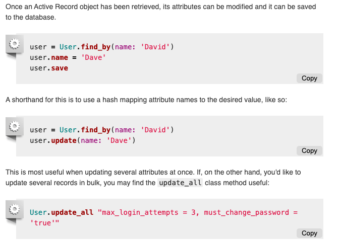

<!-- START doctoc generated TOC please keep comment here to allow auto update -->
<!-- DON'T EDIT THIS SECTION, INSTEAD RE-RUN doctoc TO UPDATE -->
**Table of Contents**  *generated with [DocToc](https://github.com/thlorenz/doctoc)*

- [Active Recoed基础](#active-recoed%E5%9F%BA%E7%A1%80)
- [ CRUD ](#crud)
  - [创建](#%E5%88%9B%E5%BB%BA)
  - [读取](#%E8%AF%BB%E5%8F%96)
  - [更新](#%E6%9B%B4%E6%96%B0)
  - [删除](#%E5%88%A0%E9%99%A4)
- [数据验证](#%E6%95%B0%E6%8D%AE%E9%AA%8C%E8%AF%81)
- [回调](#%E5%9B%9E%E8%B0%83)
- [迁移](#%E8%BF%81%E7%A7%BB)

<!-- END doctoc generated TOC please keep comment here to allow auto update -->

## Active Recoed基础

    
* 对象关系映射（ORM）是一种技术手段，把应用中的对象和关系型数据库中的数据表连接起来。使用 ORM，应用中对象的属性和对象之间的关系可以通过一种简单的方法从数据库中获取，无需直接编写 SQL 语句，也不过度依赖特定的数据库种类。 

* Active Record 是 MVC 中的 M（模型），负责处理数据和业务逻辑。Active Record 负责创建和使用需要持久存入数据库中的数据。

*  Active Record 提供了很多功能，其中最重要的几个如下：   
表示模型和其中的数据；  
表示模型之间的关系；  
通过相关联的模型表示继承层次结构；  
持久存入数据库之前，验证模型；  
以面向对象的方式处理数据库操作。

* Rails 把模型的类名转换成复数，然后查找对应的数据表

* Rails 提供的单复数转换功能很强大，常见和不常见的转换方式都能处理。如果类名由多个单词组成，应该按照 Ruby 的约定，使用驼峰式命名法，这时对应的数据库表将使用下划线分隔各单词。因此：    
数据库表名：复数，下划线分隔单词（例如 book_clubs）  
模型类名：单数，每个单词的首字母大写（例如 BookClub）

* 外键：使用 singularized_table_name_id 形式命名，例如 item_id，order_id。创建模型关联后，Active Record 会查找这个字段；

* <strong>lock_version：在模型中添加乐观锁；  
type：让模型使用单表继承；  
(association_name)_type：存储多态关联的类型；
  
  (table_name)_count：缓存所关联对象的数量。比如说，一个 Article 有多个 Comment，那么comments_count 列存储各篇文章现有的评论数量；
</strong>
<strong>覆盖命名约定</strong>  

<h2><strong> CRUD </strong></h2>

### 创建
1.new 
```text
实例化一个新对象，但不保存
```
2.create
```text
创建一个新纪录，并将其存入数据库
```

3 .在块中？

### 读取
1.丰富的API

https://ruby-china.github.io/rails-guides/active_record_querying.html

### 更新


### 删除
destroy方法

## 数据验证
<b>把数据存入数据库之前进行验证是十分重要的步骤，所以调用 save 和 update 方法时会做数据验证。

验证失败时返回 false，此时不会对数据库做任何操作。

这两个方法都有对应的爆炸方法（save! 和 update!）。爆炸方法要严格一些，如果验证失败，抛出 ActiveRecord::RecordInvalid 异常。</b>

```ruby
2.7.2 :001 > user = User.new
   (0.9ms)  SELECT sqlite_version(*)
 => #<User id: nil, name: nil, email: nil, password_digest: nil, created_at: nil, ... 
2.7.2 :002 > user.save
  TRANSACTION (0.1ms)  begin transaction
  User Exists? (0.9ms)  SELECT 1 AS one FROM "users" WHERE "users"."email" IS NULL LIMIT ?  [["LIMIT", 1]]
  TRANSACTION (0.1ms)  rollback transaction
 => false 
2.7.2 :003 > user.save!
  TRANSACTION (0.1ms)  begin transaction
  User Exists? (0.1ms)  SELECT 1 AS one FROM "users" WHERE "users"."email" IS NULL LIMIT ?  [["LIMIT", 1]]
  TRANSACTION (0.1ms)  rollback transaction
Traceback (most recent call last):
        1: from (irb):3
ActiveRecord::RecordInvalid (Validation failed: Password can't be blank, Email can't be blank)

```

https://ruby-china.github.io/rails-guides/active_record_validations.html

## 回调

Active Record 回调用于在模型生命周期的特定事件上绑定代码，相应的事件发生时，执行绑定的代码。例如创建新纪录时、更新记录时、删除记录时，等等。Active Record 回调会详细介绍回调。

## 迁移
https://ruby-china.github.io/rails-guides/active_record_migrations.html
