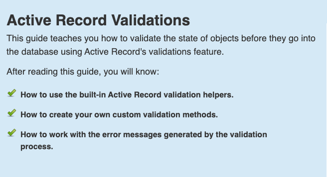

<!-- START doctoc generated TOC please keep comment here to allow auto update -->
<!-- DON'T EDIT THIS SECTION, INSTEAD RE-RUN doctoc TO UPDATE -->
**Table of Contents**  *generated with [DocToc](https://github.com/thlorenz/doctoc)*

- [Active_Record_数据验证](#active_record_%E6%95%B0%E6%8D%AE%E9%AA%8C%E8%AF%81)
  - [几个验证错误的方法](#%E5%87%A0%E4%B8%AA%E9%AA%8C%E8%AF%81%E9%94%99%E8%AF%AF%E7%9A%84%E6%96%B9%E6%B3%95)

<!-- END doctoc generated TOC please keep comment here to allow auto update -->

# Active_Record_数据验证

<strong>validates</strong>

+ 数据验证确保只有有效的数据才能存入数据库

+ 在 Rails 中做数据验证很简单，Rails 内置了很多辅助方法，能满足常规的需求，而且还可以编写自定义的验证方法。

+ 在数据存入数据库之前，也有几种验证数据的方法，包括数据库原生的约束、客户端验证和控制器层验证。

    Rails 团队认为，模型层数据验证最具普适性。

```ruby
下列方法会触发数据验证，如果验证失败就不把对象存入数据库：

create
create!
save
save!
update
update!
```
```ruby
下列方法会跳过验证，不管验证是否通过都会把对象存入数据库，使用时要特别留意。

decrement!
decrement_counter
increment!
increment_counter
toggle!
touch
update_all
update_attribute
update_column
update_columns
update_counters
注意，使用 save 时如果传入 validate: false 参数，也会跳过验证。使用时要特别留意。

save(validate: false)
```

+ valid?&invalid?

```ruby

class Person < ApplicationRecord
  validates :name, presence: true
end
 
Person.create(name: "John Doe").valid? # => true
Person.create(name: nil).valid? # => false
```
invalid?正好相反

## 几个验证错误的方法
+ errors[]
+ errors.details


