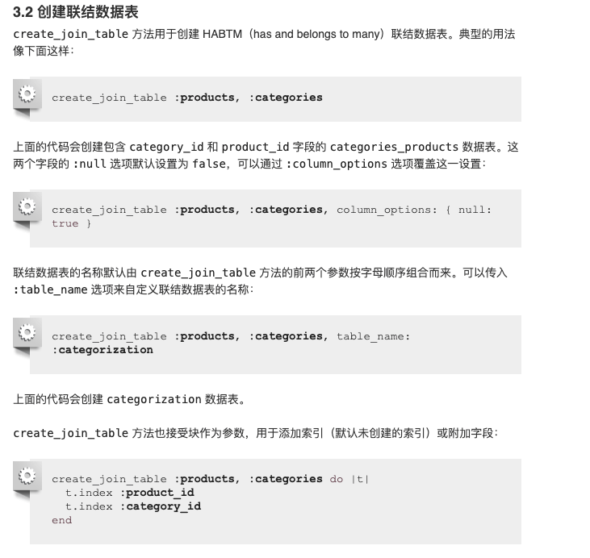

<!-- START doctoc generated TOC please keep comment here to allow auto update -->
<!-- DON'T EDIT THIS SECTION, INSTEAD RE-RUN doctoc TO UPDATE -->
**Table of Contents**  *generated with [DocToc](https://github.com/thlorenz/doctoc)*

  - [Active_Record_迁移](#active_record_%E8%BF%81%E7%A7%BB)
  - [模型生成器](#%E6%A8%A1%E5%9E%8B%E7%94%9F%E6%88%90%E5%99%A8)
  - [传递修饰符](#%E4%BC%A0%E9%80%92%E4%BF%AE%E9%A5%B0%E7%AC%A6)
  - [创建数据表](#%E5%88%9B%E5%BB%BA%E6%95%B0%E6%8D%AE%E8%A1%A8)
  - [创建联结数据表](#%E5%88%9B%E5%BB%BA%E8%81%94%E7%BB%93%E6%95%B0%E6%8D%AE%E8%A1%A8)
  - [修改字段](#%E4%BF%AE%E6%94%B9%E5%AD%97%E6%AE%B5)
  - [字段修饰符](#%E5%AD%97%E6%AE%B5%E4%BF%AE%E9%A5%B0%E7%AC%A6)
  - [如果辅助方法不够用](#%E5%A6%82%E6%9E%9C%E8%BE%85%E5%8A%A9%E6%96%B9%E6%B3%95%E4%B8%8D%E5%A4%9F%E7%94%A8)
  - [使用change方法](#%E4%BD%BF%E7%94%A8change%E6%96%B9%E6%B3%95)
  - [使用reversible方法](#%E4%BD%BF%E7%94%A8reversible%E6%96%B9%E6%B3%95)
  - [使用up和down方法](#%E4%BD%BF%E7%94%A8up%E5%92%8Cdown%E6%96%B9%E6%B3%95)
  - [撤销之前的迁移](#%E6%92%A4%E9%94%80%E4%B9%8B%E5%89%8D%E7%9A%84%E8%BF%81%E7%A7%BB)
  - [运行迁移](#%E8%BF%90%E8%A1%8C%E8%BF%81%E7%A7%BB)
  - [回滚](#%E5%9B%9E%E6%BB%9A)
  - [安装数据库 & 重置数据库](#%E5%AE%89%E8%A3%85%E6%95%B0%E6%8D%AE%E5%BA%93--%E9%87%8D%E7%BD%AE%E6%95%B0%E6%8D%AE%E5%BA%93)
  - [指定迁移 & 不同环境中运行迁移](#%E6%8C%87%E5%AE%9A%E8%BF%81%E7%A7%BB--%E4%B8%8D%E5%90%8C%E7%8E%AF%E5%A2%83%E4%B8%AD%E8%BF%90%E8%A1%8C%E8%BF%81%E7%A7%BB)
  - [修改现有的迁移](#%E4%BF%AE%E6%94%B9%E7%8E%B0%E6%9C%89%E7%9A%84%E8%BF%81%E7%A7%BB)
- [数据库模式转储](#%E6%95%B0%E6%8D%AE%E5%BA%93%E6%A8%A1%E5%BC%8F%E8%BD%AC%E5%82%A8)
  - [数据库模式转储的类型](#%E6%95%B0%E6%8D%AE%E5%BA%93%E6%A8%A1%E5%BC%8F%E8%BD%AC%E5%82%A8%E7%9A%84%E7%B1%BB%E5%9E%8B)
- [Active Record 和引用完整性](#active-record-%E5%92%8C%E5%BC%95%E7%94%A8%E5%AE%8C%E6%95%B4%E6%80%A7)

<!-- END doctoc generated TOC please keep comment here to allow auto update -->

## Active_Record_迁移

+ 使用Ruby DSL，不必手动编写SQL，从而实现数据库无关的数据库模式的创建和修改

+ Active Record 还会更新 db/schema.rb 文件，以匹配最新的数据库结构。

+ imestamps 宏添加了 created_at 和 updated_at 两个字段。

+ 某些查询不能在事务内部运行。如果数据库适配器支持 DDL 事务，就可以使用 disable_ddl_transaction! 方法在某个迁移中临时禁用事务。

+ 几个方法
    * reversible 方法  
    *  up方法
    * down方法

+ 运行迁移
```ruby
#创建迁移并适当命名
bin/rails generate migration ***
```
```ruby
bin/rails generate migration pg

Running via Spring preloader in process 59852
      invoke  active_record
      create    db/migrate/20210227073023_pg.rb

```

如果迁移名称是 AddXXXToYYY 或 RemoveXXXFromYYY 的形式，并且后面跟着字段名和类型列表，那么会生成包含合适的 add_column 或 remove_column 语句的迁移。

类似地，还可以生成用于删除字段的迁移

还可以生成用于添加多个字段的迁移

如果迁移名称是 CreateXXX 的形式，并且后面跟着字段名和类型列表，那么会生成用于创建包含指定字段的 XXX 数据表的迁移。

生成器也接受 references 字段类型作为参数（还可使用 belongs_to）
```ruby
bin/rails generate migration AddUserRefToProducts user:references
# 这个迁移会创建 user_id 字段并添加索引。
```
如果迁移名称中包含 JoinTable，生成器会创建联结数据表
```ruby
# 在新建字段上添加索引
bin/rails generate migration AddPartNumberToProducts part_number:string:index
```

## 模型生成器
模型和脚手架生成器会生成适用于添加新模型的迁移。这些迁移中已经包含用于创建有关数据表的指令。如果我们告诉 Rails 想要哪些字段，那么添加这些字段所需的语句也会被创建。

我们可以根据需要添加“字段名称/类型”对，没有数量限制。

## 传递修饰符

## 创建数据表

create_table 方法会创建 id 主键。可以用 :primary_key 选项来修改主键名称，还可以传入 id: false 选项以禁用主键。如果需要传递数据库特有的选项，可以在 :options 选项中使用 SQL 代码片段。

## 创建联结数据表
create_join_table 方法用于创建 HABTM（has and belongs to many）联结数据表。


## 修改字段
Rails 提供了与 remove_column 和 add_column 类似的 change_column 迁移方法。

change_column 命令是无法撤销的。

除 change_column 方法之外，还有 change_column_null 和 change_column_default 方法，前者专门用于设置字段可以为空或不可以为空，后者专门用于修改字段的默认值。

```ruby
change_column_null :products, :name, false
change_column_default :products, :approved, from: true, to: false
```

## 字段修饰符
```text
limit 修饰符：设置 string/text/binary/integer 字段的最大长度。
precision 修饰符：定义 decimal 字段的精度，表示数字的总位数。
scale 修饰符：定义 decimal 字段的标度，表示小数点后的位数。
polymorphic 修饰符：为 belongs_to 关联添加 type 字段。
null 修饰符：设置字段能否为 NULL 值。
default 修饰符：设置字段的默认值。请注意，如果使用动态值（如日期）作为默认值，那么默认值只会在第一次使时（如应用迁移的日期）计算一次。
index 修饰符：为字段添加索引。
comment 修饰符：为字段添加注释。
```
## 如果辅助方法不够用


## 使用change方法

## 使用reversible方法

## 使用up和down方法
可以使用 up 和 down 方法以传统风格编写迁移而不使用 change 方法。

up 方法用于描述对数据库模式所做的改变

down 方法用于撤销 up 方法所做的改变。

换句话说，如果调用 up 方法之后紧接着调用 down 方法，数据库模式不会发生任何改变。

```ruby
# 这里还没理解！

class ExampleMigration < ActiveRecord::Migration[5.0]
  def up
    create_table :distributors do |t|
      t.string :zipcode
    end
 
    # 添加 CHECK 约束
    execute <<-SQL
      ALTER TABLE distributors
        ADD CONSTRAINT zipchk
        CHECK (char_length(zipcode) = 5);
    SQL
 
    add_column :users, :home_page_url, :string
    rename_column :users, :email, :email_address
  end
 
  def down
    rename_column :users, :email_address, :email
    remove_column :users, :home_page_url
 
    execute <<-SQL
      ALTER TABLE distributors
        DROP CONSTRAINT zipchk
    SQL
 
    drop_table :distributors
  end
end
```

##  撤销之前的迁移

## 运行迁移
如果指定了目标版本，Active Record 会运行该版本之前的所有迁移（调用其中的 change、up 和 down 方法），其中版本指的是迁移文件名的数字前缀。

## 回滚
一般是回滚最后一个迁移

要想取消多个迁移，可以使用 STEP 参数

## 安装数据库 & 重置数据库

rails db:setup 任务用于创建数据库，加载数据库模式，并使用种子数据初始化数据库。

rails db:reset 任务用于删除并重新创建数据库，其功能相当于 rails db:drop db:setup。

## 指定迁移 & 不同环境中运行迁移 

要想运行或撤销指定迁移，可以使用 db:migrate:up 和 db:migrate:down 任务。只需指定版本，对应迁移就会调用它的 change 、up 或 down 方法

bin/rails db:migrate 任务默认在开发环境中运行迁移。要想在其他环境中运行迁移，可以在执行任务时使用 RAILS_ENV 环境变量说明所需环境。

## 修改现有的迁移

如果已经运行过存在错误的迁移，那么直接修正迁移中的错误并重新运行这个迁移并不能解决问题：Rails 知道这个迁移已经运行过，因此执行 rails db:migrate 任务时不会执行任何操作。必须先回滚这个迁移（例如通过执行 bin/rails db:rollback 任务），再修正迁移中的错误，然后执行 rails db:migrate 任务来运行这个迁移的正确版本。

<b>最好是编写一个新的迁移来执行我们想要的操作，这样是相对无害的！</b>

# 数据库模式转储

Active Record 通过检查数据库生成的 db/schema.rb 文件或 SQL 文件才是数据库模式的可信来源。这两个可信来源不应该被修改，它们仅用于表示数据库的当前状态。

## 数据库模式转储的类型

两种方式，可以通过 config/application.rb 文件的 config.active_record.schema_format 选项来设置想要采用的方式，即 :sql 或 :ruby

ruby----db/schema.rb
sql----db/structure.sql

（postgrsql中，可使用ide自带的数据库软件导出！
命令行资料--https://www.postgresql.org/docs/9.1/app-pgdump.html
）

db/schema.rb 文件包含数据库的当前版本号，这样可以确保在合并两个包含数据库模式文件的分支时会发生冲突。一旦出现这种情况，就需要手动解决冲突，保留版本较高的那个数据库模式文件。


# Active Record 和引用完整性

Active Record 在模型而不是数据库中声明关联。因此，像触发器、约束这些依赖数据库的特性没有被大量使用。

验证，如 validates :foreign_key, uniqueness: true，是模型强制数据完整性的一种方式。在关联中设置 :dependent 选项，可以保证父对象删除后，子对象也会被删除。和其他应用层的操作一样，这些操作无法保证引用完整性，因此有些人会在数据库中使用外键约束以加强数据完整性。