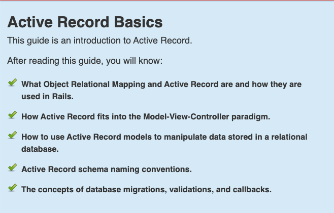
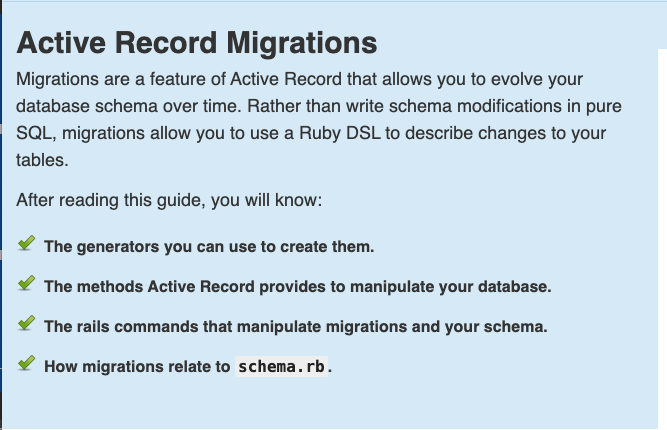
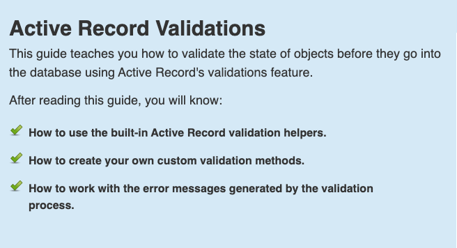

<!-- START doctoc generated TOC please keep comment here to allow auto update -->
<!-- DON'T EDIT THIS SECTION, INSTEAD RE-RUN doctoc TO UPDATE -->
**Table of Contents**  *generated with [DocToc](https://github.com/thlorenz/doctoc)*

- [rails_guides_test](#rails_guides_test)
  - [Active Record](#active-record)

<!-- END doctoc generated TOC please keep comment here to allow auto update -->

# rails_guides_test
阅读rails_guides时的笔记，想学rails的小伙伴可以直接看rails_guides。  

## Active Record

[点击这里](Active_Record_基础.md)


[点击这里](Active_Record_迁移.md)


[点击这里](Active_Record_数据验证.md)

http的四个方法————put，post，get，delete
```text
post    /url    创建
delete    /url/xxx    删除
put    /url/xxx    更新
get    /url/xxx    查看
```